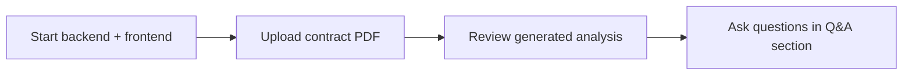

<div align="center">

# 📄 Contract Analyzer Platform

**AI-powered contract review — upload, analyze, flag risk, ask questions.**


</div>

---

## 📚 Table of Contents

- [What This App Does](#-what-this-app-does)
- [Key Features](#-key-features)
- [Tech Stack](#-tech-stack)
- [Project Structure](#-project-structure)
- [Prerequisites](#-prerequisites)
- [Setup Guide](#️-setup-guide)
- [How to Use It](#-how-to-use-it)
- [Known Limitations](#️-known-limitations)
- [Notes](#-notes)

---

## 🚀 What This App Does

Think of it as a smart workspace for contract review:

| Step | Action |
|------|--------|
| 1️⃣ | Upload a PDF contract from the web app |
| 2️⃣ | Analyze the document for important clauses and issues |
| 3️⃣ | View a structured summary with risk flags |
| 4️⃣ | Ask follow-up questions about the contract content |
| 5️⃣ | Run the full experience locally or with Docker |

---

## ✨ Key Features

<details open>
<summary><strong>Click to expand / collapse</strong></summary>

- 📤 Interactive upload experience for contract documents
- 🤖 AI-generated clause analysis and risk detection
- 💬 Q&A section for exploring contract details
- 🎨 Clean, modern UI built with React and Tailwind CSS
- ⚡ Fast backend powered by FastAPI

</details>

---

## 🧰 Tech Stack

<details>
<summary><strong>Frontend</strong></summary>

- React
- Tailwind CSS
- Axios
- React Router

</details>

<details>
<summary><strong>Backend</strong></summary>

- FastAPI
- Python
- PyPDF2
- pdfplumber

</details>

<details>
<summary><strong>AI</strong></summary>

- Groq LLM integration

</details>

<details>
<summary><strong>Dev Tools</strong></summary>

- Docker Compose
- npm

</details>

---

## 📁 Project Structure

<details>
<summary><strong>Click to expand full tree</strong></summary>

```text
contract-analyzer-project/
├── backend/
│   ├── app/
│   │   ├── api/
│   │   │   ├── models.py
│   │   │   └── routes.py
│   │   ├── core/
│   │   │   ├── config.py
│   │   │   ├── llm_service.py
│   │   │   └── pdf_processor.py
│   │   ├── services/
│   │   │   ├── contract_analyzer.py
│   │   │   └── qa_service.py
│   │   ├── utils/
│   │   │   └── validators.py
│   │   ├── main.py
│   │   └── __init__.py
│   ├── requirements.txt
│   ├── Dockerfile
│   ├── docker-compose.yml
│   └── test_groq.py
├── frontend/
│   ├── public/
│   │   └── index.html
│   ├── src/
│   │   ├── components/
│   │   │   ├── Analysis/
│   │   │   ├── Layout/
│   │   │   ├── Q&A/
│   │   │   └── Upload/
│   │   ├── context/
│   │   ├── services/
│   │   ├── utils/
│   │   ├── App.js
│   │   ├── index.css
│   │   └── index.js
│   ├── package.json
│   ├── postcss.config.js
│   ├── tailwind.config.js
│   └── README.md
├── uploads/
└── README.md
```

</details>

---

## ✅ Prerequisites

- [ ] Python 3.10+
- [ ] Node.js 18+
- [ ] npm or yarn
- [ ] A Groq API key

---

## ⚙️ Setup Guide

<details>
<summary><strong>1️⃣ Backend setup</strong></summary>

```bash
cd backend
python -m venv .venv
source .venv/bin/activate   # Windows: .venv\Scripts\activate
pip install -r requirements.txt
```

Create a `.env` file in the backend folder:

```env
GROQ_API_KEY=your_groq_api_key
GROQ_MODEL=llama-3.3-70b-versatile
```

Start the API:

```bash
uvicorn app.main:app --reload --port 8000
```

</details>

<details>
<summary><strong>2️⃣ Frontend setup</strong></summary>

```bash
cd frontend
npm install
npm start
```

Open [http://localhost:3000](http://localhost:3000) to use the app.

</details>

<details>
<summary><strong>3️⃣ Docker setup</strong></summary>

```bash
cd backend
docker compose up --build
```

This starts the backend service on port 8000.

</details>

---

## 🔗 How to Use It



1. Start both the backend and frontend
2. Upload a contract PDF
3. Review the generated analysis
4. Ask questions in the Q&A section

---

## ⚠️ Known Limitations

> Worth reading before you assume this is plug-and-play.

- **Single LLM provider** — the analysis pipeline is hard-wired to Groq (`llama-3.3-70b-versatile`). No provider is documented; swapping models means editing `llm_service.py` directly.
- **Hardcoded backend URL** — the frontend assumes the API lives at `http://localhost:8000`. No `.env`-driven config is mentioned for the frontend, so deploying anywhere else needs a manual code change.
- **No auth mentioned** — nothing in this README indicates access control on uploads or the Q&A endpoint.
- **Local file storage** — uploads go to a local `uploads/` folder; no cleanup, size limits, or retention policy is described.

---

## 📝 Notes

- Uploaded files are stored in the `uploads/` folder
- The app currently uses Groq for AI-powered analysis and question answering
- The frontend expects the backend to be available at `http://localhost:8000`
